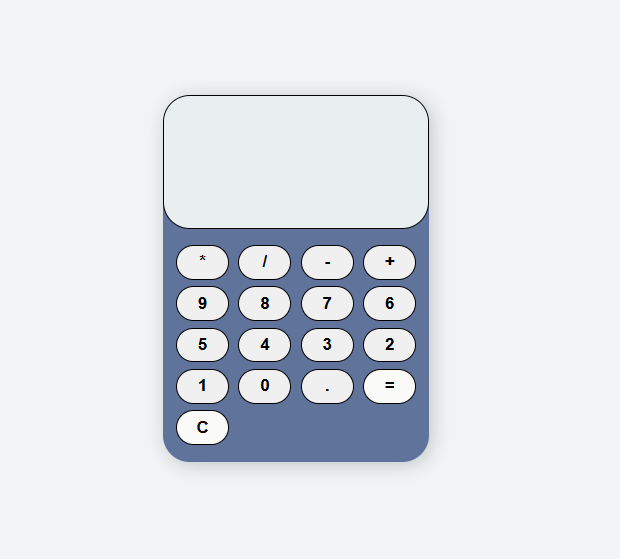
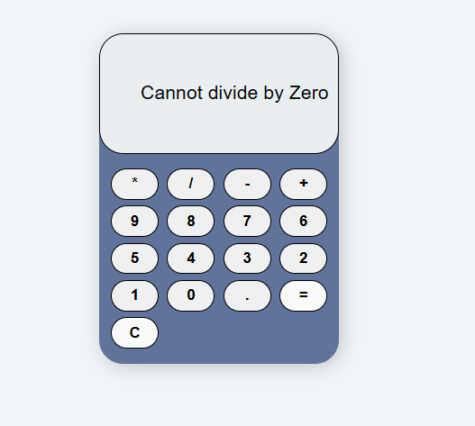

*Calculator Web App*

**A simple calculator web application built using HTML, CSS, and JavaScript. This project provides basic arithmetic operations such as addition, subtraction, multiplication, and division.**

**Screenshot**

*Features*
    1.Perform basic arithmetic operations (+, -, *, /)
    2. User-friendly interface with a responsive design
    3. Clear button to reset calculations
    4. Interactive button clicks with smooth UI experience

*Technologies Used*

    1. HTML: Structure of the calculator
    2. CSS: Styling and layout
    3. JavaScript: Functionality and event handling

*Installation*

Clone this repository:

git clone [text](https://github.com/jaysreeb/Calculator.git)

*Usage*

Click on the numbers and operators to perform calculations.

Press the "=`" button to display the result.

Use the "C" button to clear the screen.

**Future Enhancements**

        1. Add keyboard support for input

        2. Implement advanced mathematical functions

        3. Improve UI/UX with animations

**Contributing**

Contributions are welcome! Feel free to fork this repository and submit pull requests.

*License*

This project is licensed under the MIT License.

*Acknowledgments*

**Inspired by various online calculator applications and tutorials:**
    1. CSS: https://medium.com/@kshitijsharma94/building-a-simple-calculator-with-html-css-and-javascript-1bda25ce3d80
    It was easy to undestand the css part from this medium article.

